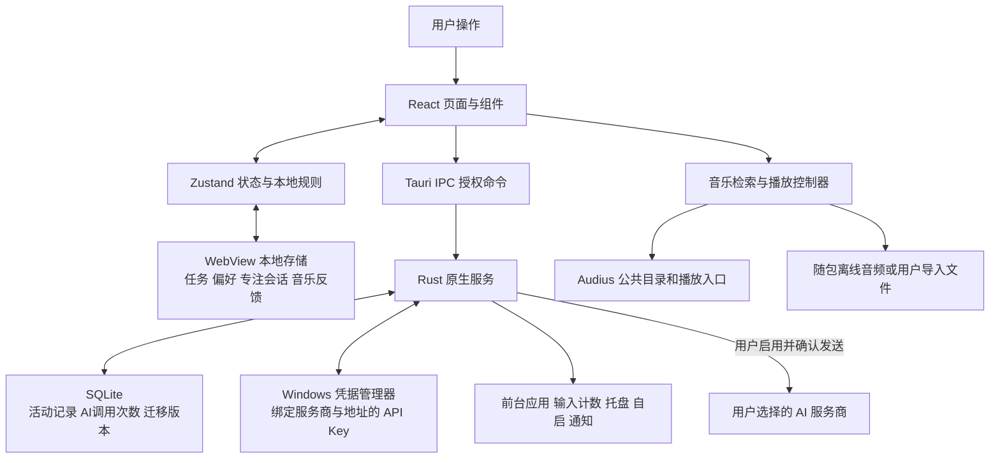
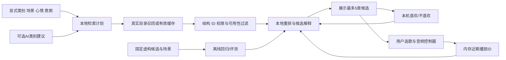

# DayMate 工程手册

更新日期：**2026-09-12**。说明范围：**v0.8.0 开发与验收**。

这份手册帮助使用者和贡献者快速回答三个问题：用了什么技术、功能怎样连起来、怎样证明它确实可用。安装和日常操作请看 [用户手册](../USER_GUIDE.md)；研究来源和不采用某些热门技术的理由见 [研究与决策](research-and-decisions-v0.8.0.md)。

“有实现”表示仓库存在对应代码，不等于本版云端检查、真实音乐播放或所有 Windows 设备都已验收。最终版本与通过记录以 [更新日志](../CHANGELOG.md) 和该版本 GitHub Actions 为准。

## 1. 一分钟理解架构

DayMate 是桌面应用，不是把用户数据上传到一个自建网站。界面用网页技术制作，Windows 能力由 Rust 在本机执行；用户选择启用 AI 后，才通过其配置的服务商提供增强功能。



如果阅读器不支持 Mermaid：**用户点界面 → 状态和规则处理 → 需要系统能力时通过 Tauri 调用 Rust → Rust 访问 Windows / SQLite / 凭据管理器**。音乐目录检索和音频播放在 WebView；远程 AI 请求在 Rust。两条网络通道不同，不要把“关闭 AI”理解成“音乐也不会联网”。

| 技术                         | 在这里负责什么                                              | 不负责什么                                                  |
| ---------------------------- | ----------------------------------------------------------- | ----------------------------------------------------------- |
| React + TypeScript           | 中文页面、表单、错误/空状态、播放操作；类型约束减少接口误用 | 不直接读取 Windows 键盘或数据库文件                         |
| Vite + CSS + Recharts        | 开发构建、现有样式、应用时间排行和占比图                    | 当前不是 Tailwind 驱动；图表不证明工作产出                  |
| Zustand                      | 页面共享任务、偏好、专注和音乐反馈状态；选择性持久化        | 不自动等于数据库，也不是多窗口强隔离或云同步                |
| Tauri 2 IPC                  | 把有限的前端请求交给原生命令，并按窗口授权                  | 不能跳过 Rust 输入校验；浏览器预览没有这些系统能力          |
| Rust                         | Windows 采集、托盘/自启/通知、AI 请求约束、数据库访问       | 不录制按键内容、截图或用户文档                              |
| SQLite / rusqlite            | 活动会话、每日 AI 调用次数、事务迁移；WAL 与索引            | 当前不存任务、音乐反馈或专注历史表                          |
| Windows 凭据管理器 / keyring | 保存 API Key，记录与服务商及最终接口地址的绑定              | 不是全磁盘加密，不能阻止已获当前 Windows 用户权限的软件攻击 |

## 2. 从功能找到代码

下列路径以仓库根目录为起点。新增功能应在相邻模块补测试，不需要为了目录“看起来复杂”搬动全部代码。

| 要看什么                   | 主要入口                                                                                                                                                                                                                            | 当前边界                                                    |
| -------------------------- | ----------------------------------------------------------------------------------------------------------------------------------------------------------------------------------------------------------------------------------- | ----------------------------------------------------------- |
| 页面、导航、时间回顾、设置 | [`src/App.tsx`](../src/App.tsx)、[`src/App.css`](../src/App.css)                                                                                                                                                                    | 仍有较多页面组合集中于 App，持续按真实职责拆分              |
| 任务和偏好                 | [`src/store.ts`](../src/store.ts)、[`src/services/persistedState.ts`](../src/services/persistedState.ts)                                                                                                                            | WebView 本地存储；逐字段恢复和损坏数据保护                  |
| 专注会话                   | [`src/focusStore.ts`](../src/focusStore.ts)、[`src/services/focusSession.ts`](../src/services/focusSession.ts)、[`src/useFocusClock.ts`](../src/useFocusClock.ts)                                                                   | 当前会话恢复，不是完整专注历史或工时结算                    |
| 音乐目录、缓存与资格过滤   | [`src/services/music.ts`](../src/services/music.ts)                                                                                                                                                                                 | 实际目录候选、受限标志过滤、失败回退                        |
| 音乐排序与反馈             | [`src/services/musicRanking.ts`](../src/services/musicRanking.ts)、[`src/musicStore.ts`](../src/musicStore.ts)                                                                                                                      | 本地规则、有限元数据与显式反馈，不是训练后的推荐模型        |
| 持久音乐控制器与界面       | [`src/features/music/playback.ts`](../src/features/music/playback.ts)、[`SmartMusicPlayer.tsx`](../src/features/music/SmartMusicPlayer.tsx)、[`LocalMusicImport.tsx`](../src/features/music/LocalMusicImport.tsx)                   | 已有页面外控制器实现；本版跨页和连播行为仍需完整回归确认    |
| 场景、每日内容、主题       | [`src/services/companionContext.ts`](../src/services/companionContext.ts)、[`src/data/dailyContent.ts`](../src/data/dailyContent.ts)、[`src/services/dailyTheme.ts`](../src/services/dailyTheme.ts)                                 | 用户自选场景/心情；本地内容和日期规则，不自动生成背景图片   |
| AI 设置与本地回退          | [`src/services/aiProviders.ts`](../src/services/aiProviders.ts)、[`aiPreferences.ts`](../src/services/aiPreferences.ts)、[`aiModels.ts`](../src/services/aiModels.ts)、[`aiRecommendation.ts`](../src/services/aiRecommendation.ts) | 服务商独立连接档案、模型目录、结构化类别和独立鼓励          |
| 原生桥接与双窗口           | [`src/native.ts`](../src/native.ts)、[`src/services/system.ts`](../src/services/system.ts)、[`src/windows.ts`](../src/windows.ts)                                                                                                   | `main` 主窗口与 `companion` 浮球；显示/隐藏不等于启动新进程 |
| Windows 和原生命令         | [`src-tauri/src/lib.rs`](../src-tauri/src/lib.rs)、[`system.rs`](../src-tauri/src/system.rs)                                                                                                                                        | 采样、输入次数、图标、托盘、单实例、自启、通知              |
| AI 安全与数据库            | [`src-tauri/src/ai.rs`](../src-tauri/src/ai.rs)、[`database.rs`](../src-tauri/src/database.rs)、[`capabilities`](../src-tauri/capabilities)                                                                                         | 请求/响应校验、调用预算、凭据绑定、主窗口/浮球权限分离      |

## 3. 数据究竟保存在哪里

| 数据                                          | 实际保存方式                                         | 生命周期和隐私边界                                                               |
| --------------------------------------------- | ---------------------------------------------------- | -------------------------------------------------------------------------------- |
| 引导状态、任务、普通偏好、服务商地址/模型档案 | WebView localStorage，键 `daymate-state-v1`          | 留在本机；不是 SQLite；不含 API Key                                              |
| 当前专注会话                                  | WebView localStorage，键 `daymate-focus-v1`          | 保存任务引用/标题、截止时刻或暂停剩余秒数、状态、通知标志；不上传 AI             |
| 喜欢/不喜欢                                   | WebView localStorage，键 `daymate-music-feedback-v1` | 最多 200 条，保存曲目 ID、标题、音乐人、类别、评价和更新时间；用户可清除         |
| 当前场景、心情、音乐意图、近期播放 ID         | 内存状态                                             | 不作为长期画像；近期列表最多 30 个 ID，退出后不恢复                              |
| 音乐查询池 / AI 结果缓存                      | 进程/WebView 内存                                    | 有容量或时效限制，重启失效；不是云端个人资料                                     |
| 活动会话、AI 每日次数                         | `daymate.sqlite3`                                    | 当前 schema v5；表为 `app_usage_sessions`、`ai_daily_usage`、`migration_history` |
| API Key                                       | Windows 凭据管理器                                   | 不写普通配置、导出文件或日志；改变绑定目标后不能直接复用旧 Key                   |
| 用户导入音频                                  | 用户文件及播放用临时 Blob                            | 不自动上传；浏览器 Blob 不代表音频已获得公共分发授权                             |

原生数据库目录优先使用 `DAYMATE_DATA_DIR`，其次使用应用保存的数据目录启动参数，再回退到 Tauri 应用数据目录。界面“数据与隐私”显示的是活动数据位置，不能据此认为 WebView 存储和系统凭据也都在该目录。开发脚本将临时文件、缓存与活动数据指向项目父目录，安装用户仍应检查实际目录。

两个窗口同源共享 WebView 存储。`capabilities` 限制的是原生命令权限，不是对同源存储加密或隔离。浮球没有主窗口的 AI 和活动数据库命令授权，Key 也不放入共享存储。

损坏本地存储先保留原值/恢复副本，写入失败显示错误；不能把“能恢复部分字段”解释为完整备份系统。任务、反馈和专注记录统一迁移到 SQLite、跨窗口事务一致性和完整备份恢复仍需后续设计。

## 4. 一首推荐音乐怎样来到播放器



文字备用：**用户选择 → 生成查询 → 从目录取真实候选 → 过滤不能播放的结果 → 本地排序 → 展示候选及理由 → 用户选歌播放 → 显式反馈影响下一轮**。离线评测使用固定测试数据，既不上传真实反馈，也不消耗用户 Key。

### 4.1 召回和资格先于“智能”

`music.ts` 对音乐查询池使用 10 分钟缓存、最多 16 个查询和相同请求合并。请求保留 12 秒超时、512 KiB 响应限制和禁止检索重定向；失败或无有效曲目不作为成功缓存。缓存键同时包含查询和排序后的心情过滤项，避免不同条件混用结果。

显式搜索不额外加心情过滤，并在资格、不喜欢与去重处理后保留平台搜索顺序；不对找歌结果施加心情/喜欢加分或近期硬排除，避免精确找歌被推荐规则挡住。非搜索推荐带心情过滤但目录为空时，最多扩大一次到同类查询，并明确标注不保证心情匹配；网络、鉴权或限流错误不触发这种扩大查询。

平台返回值是不可信输入。先检查曲目 ID、字段与受限标志，播放地址由验证过的 ID 构造官方入口，不接受返回正文里任意 `stream_url`。不喜欢与近期去重是排序阶段的另一层约束，不能替代平台权限过滤。

搜索无结果会解释当前目录覆盖边界；不承诺所有中文商业歌曲都能播放。非搜索推荐失败可回退随包离线音乐，并说明原因。离线曲目数量有限，不等于线上推荐永远只有四首。

### 4.2 重排算法：可解释的工程规则

算法标识为 `mood-feedback-v1`。`planMusic` 按明确类别、场景、用户心情与“贴合 / 提振”意图生成检索提示；自动场景才参考时段和是否有任务。安静场景优先，不因选择提振就强制改为高强度音乐。

当前计分来自 `musicRanking.ts`：

| 规则                                 | 分值或处理                         | 解释依据                                         |
| ------------------------------------ | ---------------------------------- | ------------------------------------------------ |
| 发布者类型/标签匹配检索关键词        | +8                                 | 只能引用真实 `genre` / `tags`                    |
| 发布者 `mood` 与本次方向匹配         | +12                                | 它是发布者标签，不是程序听懂了音频或科学测得情绪 |
| 本机喜欢过这首歌                     | +6                                 | 用户主动反馈                                     |
| 没有本曲喜欢，但喜欢过同音乐人的作品 | +3                                 | 本地反馈中的音乐人；不是用户群协同过滤           |
| 已选候选包含同一音乐人               | -5                                 | 减少候选列表过度集中                             |
| 本机不喜欢、重复曲目 ID              | 排除                               | 不用分数抵消用户明确反对                         |
| 近期 30 个 ID                        | 有新候选时先排除；全部轮换完才放宽 | 放宽时解释“候选较少，本次允许重复”               |
| 同分                                 | 种子与曲目 ID 的稳定哈希，再按 ID  | 便于同输入回归，不代表质量差异                   |

输入最多取 80 条，输出最多 5 首。缺少元数据时明确不能确认心情匹配；不从歌名猜测音乐语言、BPM、能量或疗效。这些分数是**工程启发式权重，不是概率、模型置信度、论文复现值或真实用户验证结果**，将来调参必须同步算法版本和评测。

空作者与统一的未知作者占位名不参与同音乐人加分或集中度降权，避免错误归因；对该具体曲目的喜欢仍然有效。显式搜索采用零评分、原目录顺序，并给出搜索来源解释，不冒充心情排序结果。

### 4.3 播放生命周期

v0.8.0 控制器代码将页面订阅与播放生命周期分开：音频对象、曲终监听和下一首行为由独立控制器持有。页面卸载、主窗口隐藏不应暂停音频或撤销曲终监听；退出进程才结束播放。音频 Blob 在换曲/清空时释放，避免泄漏。

浏览器可能要求首次播放由用户点击触发。持续播放不等于允许开机未经用户操作就自动播放，也不等于退出后自动恢复音频。此部分必须结合控制器单测、界面回归和实际桌面验收，不能用模拟 Audio 测试证明音频设备一定正常。

## 5. AI 增强的完整边界

1. 用户在设置中选服务商、地址和模型；Key 通过原生命令存入凭据管理器。切换服务商恢复其独立普通连接档案。
2. 前端显示将发送的有限字段；`music-intent-v2` 契约包含音乐偏好、场景、心情、`match`/`lift` 意图和小时，活动分钟/未完成数只有显式开启汇总共享才发送。音乐喜欢/不喜欢、近期 ID 和任务全文不发给 AI。
3. `native.ts` 经 Tauri 调用 Rust。主窗口有相关能力；纯浏览器模式不伪造原生结果，会说明需要桌面版。
4. Rust 验证服务商、地址、凭据绑定、模型和输入范围；限制在途请求、每日次数、超时与响应大小，缓存有失效控制。AI 测试与真实请求可能消耗服务商额度。
5. 音乐响应仅允许受控类别和理由，鼓励仅允许文本；拒绝多余字段、非法输出或空正文。AI 不获得打开程序、执行代码、改数据库或任意联网的工具权限。
6. 超时、额度、鉴权、网络或格式失败回到明确的本地规则。失败不是“已经执行成功”，也不默认无限重试。

普通 OpenAI 兼容协议不保证所有服务商的模型列表、推理开关或图片接口都一样。当前已实现的适配与操作说明见 [AI 配置指南](ai-setup.md)。图片生成、组织知识 RAG、向量检索、多 Agent 和微调不在当前链路中。

当前 SQLite 的调用次数不是 token 计费账单。完整匿名性能指标、token 成本追踪、线上质量监测和人工校准体系尚未建立；不能宣称已有全套 LLMOps。

## 6. 时间统计和专注计时不是同一种时钟

**活动记录**约每 3 秒采样前台应用，累计鼠标/键盘事件次数而不保存内容，结合空闲阈值判断活跃。按应用切换、跨日或批量刷新写 SQLite；本机图标用于回顾展示。单调时钟与实际时间轴用于排除休眠、调时等不确定区间。它是近似电脑活动统计，不是工资计算或工作质量评分。

`activityDates.ts` 生成本地日期，昨日回顾查昨天而不是复用今日数据。选择历史日期后，历史累计和当前应用状态不应混成“那天现在正在使用”。没有采集记录应显示空数据。

应用切换使用所选日期内相邻非空应用名称变化（不区分大小写），不是会话表行数；同应用周期写库和单纯进入/退出空闲不增加次数，当天第一项不计跨日变化。约三秒采样之间发生的多次快速切换仍可能无法完整捕获。

**专注计时**保存绝对截止时刻，而不是依赖每秒 `setInterval` 减一。计时器只刷新界面，恢复/唤醒时根据截止时刻重算。暂停保存剩余秒数，继续生成新截止时刻；过期会话转完成，通知领取标志避免重复提示。它记录计划倒计时，不证明用户始终专注；程序退出期间经过的时间也会影响恢复后的倒计时。

正常退出先请求采样线程刷新，保存出错或 6 秒内未确认时阻止本次退出并提示用户，避免直接丢弃仍在内存中的活动。强制杀进程、断电或操作系统无法写盘不能承诺完全无损。应以采样批量写入周期和退出回归测试界定损失窗口。

## 7. 如何验证，而不是只看界面

在仓库根目录执行。开发环境准备见 [开发说明](development.md)。以下是可执行检查入口，**不是本文件预先宣布的通过结果**。

```powershell
npm ci
npm run format:check
npm run lint
npm run typecheck
npm run test
npm run eval:music
npm run build
npm run version:check
node --test scripts/test-release.mjs scripts/test-audit-rust.mjs scripts/test-check-sarif.mjs
cargo fmt --manifest-path src-tauri/Cargo.toml --all -- --check
cargo clippy --locked --manifest-path src-tauri/Cargo.toml -- -D warnings
cargo test --locked --manifest-path src-tauri/Cargo.toml
```

Windows 本地 C++/Rust 环境需要额外初始化时，可使用已有的 `npm run desktop:test` 和 `npm run desktop:clippy` 包装脚本。不要把 `desktop:dev` 或安装冒烟脚本当成只读检查，它们可能启动应用。

| 验证层                | 入口 / 证据                                                                                                                          | 能证明什么                                                                                   | 不能证明什么                                                 |
| --------------------- | ------------------------------------------------------------------------------------------------------------------------------------ | -------------------------------------------------------------------------------------------- | ------------------------------------------------------------ |
| 前端规则与组件        | 相邻 `*.test.ts(x)`，`npm run test`                                                                                                  | 固定输入、状态、恢复、错误分支与界面交互                                                     | 真实模型质量、真实播放器输出、操作系统兼容性                 |
| Rust 单测与本地假服务 | `src-tauri/src/*.rs` 内测试，`cargo test --locked ...`                                                                               | 参数/凭据绑定、迁移、计数、网络错误与响应验证                                                | 所有真实服务商当前可用或全量外设行为                         |
| 浏览器 UI 冒烟        | [`e2e/companion.e2e.ts`](../e2e/companion.e2e.ts)、[`ui-smoke.yml`](../.github/workflows/ui-smoke.yml)                               | 云端 Chromium 的模拟数据界面、断言、截图与控制台错误                                         | Tauri IPC、Key 存储、通知、自启、真实音乐网络                |
| Windows 安装冒烟      | [`smoke-windows.ps1`](../scripts/smoke-windows.ps1)、[`release.yml`](../.github/workflows/release.yml)                               | 两个 Windows Server runner × 全新/旧 v4 模拟数据，共四组安装、启动、数据库、单实例与迁移检查 | Windows 10/11 完整 UI、重启/休眠、真实鼠标键盘和音频设备验收 |
| 安全与供应链          | [`dependency-audit.yml`](../.github/workflows/dependency-audit.yml)、[`codeql.yml`](../.github/workflows/codeql.yml)、SARIF/审计脚本 | 当前依赖库报告和高危静态检测门禁                                                             | 绝对没有漏洞，或风险报告已全部消除                           |

浏览器和安装冒烟在 GitHub runner 上执行，使用虚构数据/独立临时目录，不测试或替换维护者电脑上的旧应用。真实 AI live 测试默认跳过；不能为让 CI 变绿而填入个人 Key。

`npm run eval:music` 运行 `src/services/musicEvaluation.test.ts`，读取 `src/data/music-eval-v1.json` 中手工编写的 12 个合成场景和 12 首虚构曲目元数据，对照旧日期轮换基线，输出策略版本、心情标签命中比例和候选覆盖度。它不访问真实曲库、不发 AI 请求、不使用用户反馈。

这些数值只说明规则在这组**合成数据**上的行为，不是推荐满意度、疗效、真实目录准确率或 NDCG。样本由开发者编写，存在覆盖与偏好偏差；指标不能替代人工相关性标注和用户研究。调整参数应保留原基线，不能只更换用例让分数变好。

每份新增评测应保存算法/用例版本、样本数、通过项与失败案例；没有人工相关性标注时，不发布 NDCG 或“推荐准确率”。目前尚缺具有代表性的真实用户偏好研究、A/B 实验和长期效果证据。

## 8. 岗位要求怎样对应到这个项目

来源与样本限制见 [官方岗位研究](research-and-decisions-v0.8.0.md)。这张表是工程能力映射，不是宣称已经符合所有岗位或企业生产规模。

| 样本中的能力方向                | 已有实现 / 本轮代码范围                                          | 验证入口                                              | 仍缺什么                                       |
| ------------------------------- | ---------------------------------------------------------------- | ----------------------------------------------------- | ---------------------------------------------- |
| 业务问题到用户功能，何时不用 AI | 离线每日内容、规则选任务、AI 失败回退                            | `store.test.ts`、`aiRecommendation.test.ts`、组件回归 | 用户访谈、效果指标、长期使用研究               |
| API 接入、治理和可靠性          | `native.ts` / `ai.rs` 的有限 IPC、配置校验、预算、缓存和失败处理 | Rust 假服务测试、AI 设置组件测试                      | 企业开放平台、分布式高可用、多租户治理         |
| 可解释推荐 / 数据结构与算法     | `musicRanking.ts`、有界查询池和反馈                              | 相邻规则测试、版本化固定用例                          | 协同过滤、大目录索引、人工标注排序质量         |
| 效果评测与质量闭环              | 单测、模拟 UI、安装与安全发布门禁                                | CI、Playwright 截图、SARIF 和四组安装任务             | 线上模型漂移监测、人工评分校准、统计显著性实验 |
| 状态管理、稳定性、数据恢复      | Zustand 持久状态恢复、专注截止时刻、SQLite 迁移                  | 存储/计时/迁移测试                                    | 统一事务数据层、完整备份恢复、全面真机长稳测试 |
| 安全与隐私                      | Key 与目标绑定、最小原生命令权限、不记录输入正文                 | 权限清单、Rust 校验测试、CodeQL、依赖审计             | 独立安全审计、渗透测试、企业合规认证           |
| 版本控制与可交付软件            | SemVer、CHANGELOG、Tag 检查、安装包与校验和、门禁后发布          | `version:check`、发布脚本测试、Release 工作流         | 签名安装包/更新体系需独立密钥与发布方案        |

RAG、LangGraph、向量数据库、MCP 或多 Agent 在某些岗位出现，不意味着每个项目都必须采用。当前没有用户授权读取的知识库，音乐候选规模也有限；硬加这些组件只会扩大成本、故障和隐私边界。

## 9. 下一步的合理顺序

1. 先完成当前版本的规则、跨页播放、日期与专注恢复回归，再看真实用户反馈。
2. 如需更完整备份、跨窗口一致性或专注历史，再设计 WebView → SQLite 的一次性迁移。
3. 有标注和规模证据后，再评估更复杂的推荐方法；保留现有启发式作为可比较基线。
4. 如需新增 AI 平台或图片模型，分别核验接口、权限、费用、许可和错误行为，不复用未经核验的能力假设。

每次用户可见变化更新 CHANGELOG，配置变化更新文档，算法变化保留可复现测试。具体发布步骤见 [发布说明](release.md)。
